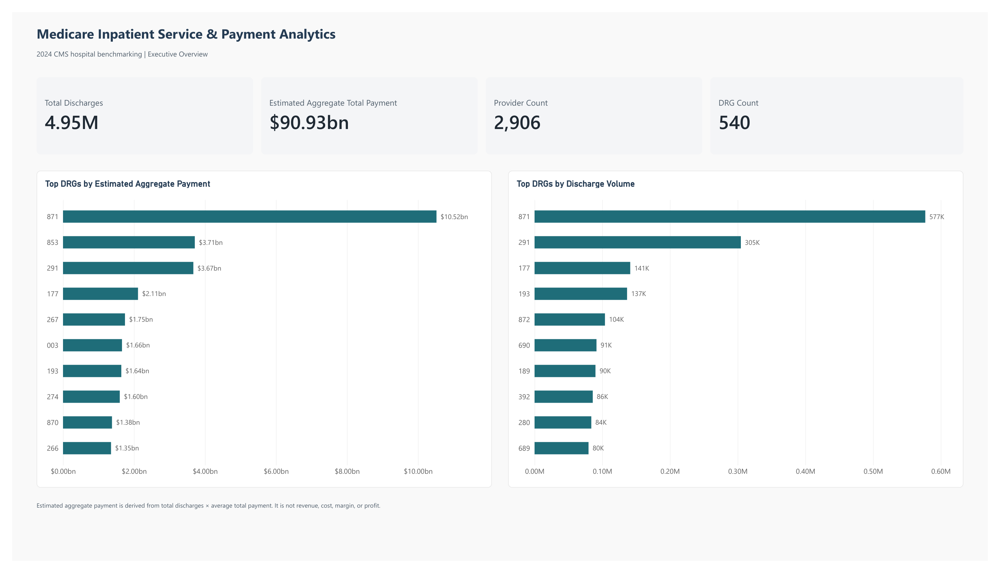
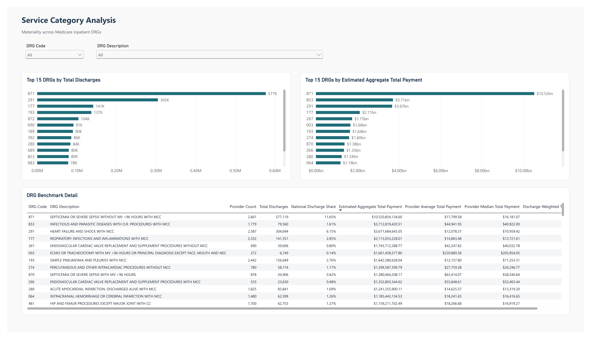
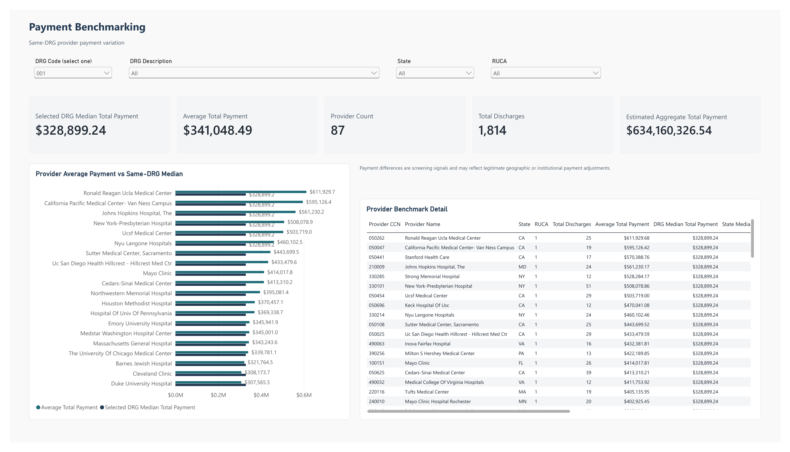
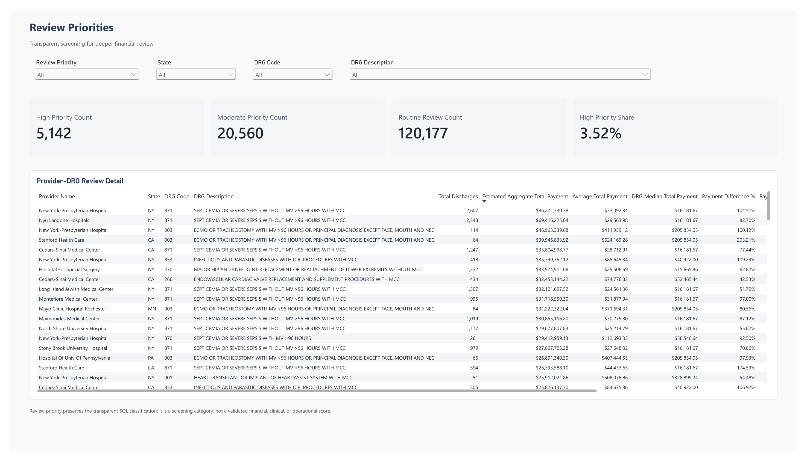

# Medicare Inpatient Service & Payment Analytics

**Hospital benchmarking using public CMS data**

## Business Problem

This local screening system helps **Hospital Strategy & Finance Leadership** decide which Medicare inpatient service categories warrant deeper review based on activity volume, estimated payment exposure, and payment variation for the same DRG. It does not determine profitability, internal cost, operational efficiency, reimbursement appropriateness, staffing, patient outcomes, or causes of payment differences.

## Architecture

```text
CMS Data API
  -> Python ingestion and validation
  -> SHA-256
  -> Azurite Blob Storage (authoritative raw snapshot)
  -> Python typed load
  -> PostgreSQL staging
  -> PostgreSQL star model and analytical views
  -> Power BI Desktop
```

Docker Compose runs Azurite Blob Storage on `127.0.0.1:10000` and PostgreSQL on `127.0.0.1:5432`, with persistent named volumes. No Azure subscription or paid cloud service is required.

Power BI consumes `analytics.v_portfolio_overview`, `analytics.v_drg_benchmark`, and `analytics.v_provider_drg_review_priority`.

## Data

CMS [Medicare Inpatient Hospitals — by Provider and Service](https://data.cms.gov/provider-summary-by-type-of-service/medicare-inpatient-hospitals/medicare-inpatient-hospitals-by-provider-and-service), reporting year 2024.

| Item | Verified value |
| --- | --- |
| Rows | 145,879 |
| Columns | 15 |
| Providers | 2,906 |
| DRGs | 540 |
| Total discharges | 4,952,481 |
| Estimated Aggregate Total Payment | $90,927,479,915.25 |
| Estimated Aggregate Medicare Payment | $75,111,479,728.47 |
| Duplicate `Rndrng_Prvdr_CCN + DRG_Cd` keys | 0 |

Provenance: [`research/domain_and_data.md`](research/domain_and_data.md).

`Estimated Aggregate Total Payment` is `Total Discharges × Average Total Payment`. It is an estimate derived from aggregated source measures—not revenue, cost, margin, or profit.

## Dashboard

Four-page Power BI Desktop report (PBIP / enhanced PBIR / TMDL, PostgreSQL Import mode). The PDF is a real Desktop export. The PNGs below are lossless rasters of that PDF.

[Report PDF](report/Medicare_Inpatient_Service_Payment_Analytics.pdf) · [Executive summary](report/executive_summary.md)

**Executive Overview**



| Service Category Analysis | Payment Benchmarking |
| --- | --- |
|  |  |

**Review Priorities**



## Key Findings

- **DRG 871** is the largest category by activity and estimated payment exposure: 577,119 discharges (11.65% of national discharges) and approximately $10.52B estimated aggregate total payment.
- **DRG 853** shows approximately $3.71B estimated aggregate total payment with only 79,560 discharges, so payment materiality and volume should be reviewed together.
- **5,142** provider–DRG observations (3.52%) are classified High review priority; 20,560 Moderate and 120,177 Routine.
- Within DRG 871, provider median, average, and discharge-weighted total payments differ ($16,181.67 / $17,799.58 / $18,229.96). That variation is a screening signal, not a causal finding.

## Technical Implementation

- Python, pandas, CMS REST API
- Azure Blob Storage-compatible interfaces through Microsoft Azurite for local reproducible development
- Docker Compose, PostgreSQL, SQL
- Dimensional / star modeling and curated analytical views
- Power BI Desktop, Power Query, DAX, PBIP / PBIR / TMDL

## Reproduction

Copy `.env.example` to `.env`, set a local PostgreSQL password, and insert the documented Azurite `devstoreaccount1` connection string already used by the local emulator.

```powershell
python -m venv .venv
.\.venv\Scripts\Activate.ps1
python -m pip install -r requirements.txt
python -m pip install -r requirements-dev.txt
.\scripts\preflight.ps1
docker compose up -d --wait
python python/run_pipeline.py
```

The preflight detects a running legacy `healthcare-azurite` container, port conflicts, and whether `healthcare_azurite_data` will be reused. It never removes a container or volume. If the legacy container is running, stop—but do not remove—it before starting Compose.

Each stage is independently runnable:

```powershell
python python/ingestion/cms_inpatient_ingest.py
python python/database/load_staging.py
python python/database/build_analytics.py
python python/storage/list_raw_blobs.py
python -m pytest
jupyter nbconvert --to notebook --execute notebooks/02_data_profiling.ipynb --inplace
node powerbi/validate_pbip_project.mjs
```

Run business queries with:

```powershell
Get-Content -Raw sql/06_business_analysis.sql | docker compose exec -T postgres psql -U $env:POSTGRES_USER -d $env:POSTGRES_DB
```

Open `powerbi/Medicare_Inpatient_Service_Payment_Analytics.pbip` in Power BI Desktop after the analytics views exist.

## Limitations

The source covers Original Medicare fee-for-service IPPS activity and suppresses provider/DRG combinations with 10 or fewer discharges. It is aggregated rather than patient-level. Payment differences can reflect geographic and institutional payment adjustments. Outputs identify potential outliers and review priorities; they do not establish causation or recommend expansion, closure, or corrective action.

## Repository Structure

```text
docker-compose.yml             Local Azurite and PostgreSQL services
python/ingestion/              CMS retrieval, validation, checksum, Blob upload
python/database/               Typed staging load and analytics build
python/storage/                Read-only Blob inspection
python/run_pipeline.py         Lightweight orchestration
sql/                           Schemas, model, transformations, checks, analysis
notebooks/                     Preserved understanding and profiling workflows
powerbi/                       PBIP report, TMDL model, theme, build/validate scripts
report/                        Executive summary and Power BI Desktop PDF export
assets/powerbi/                PNG rasters of the exported PDF pages
research/                      Business case, provenance, and data dictionary
scripts/preflight.ps1          Non-destructive collision and volume checks
tests/                         Lightweight raw-validation tests
```

Raw datasets, secrets, temporary files, Docker volume state, and Power BI `.pbi/` cache are excluded from Git.
